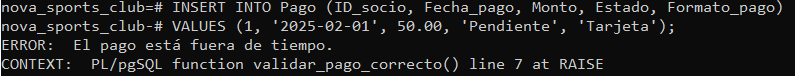

# ADBD-Proyecto_Final

##  Consultas de ejemplo del funcionamiento de la Base de Datos

### Consulta 1: El pago esta fuera del tiempo
Si intentamos insertar un pago fuera  del tiempo saldrá un error:

### Consulta 2: 
